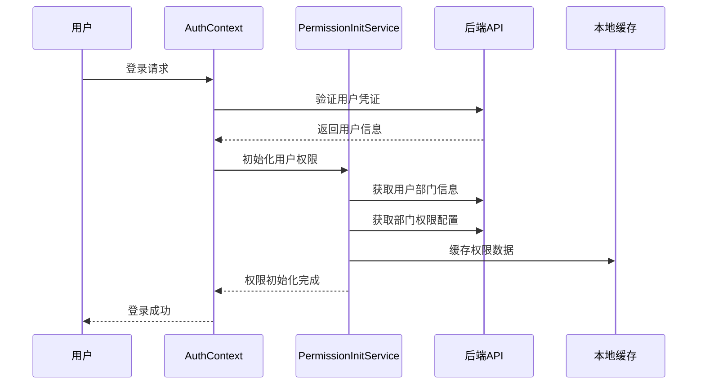
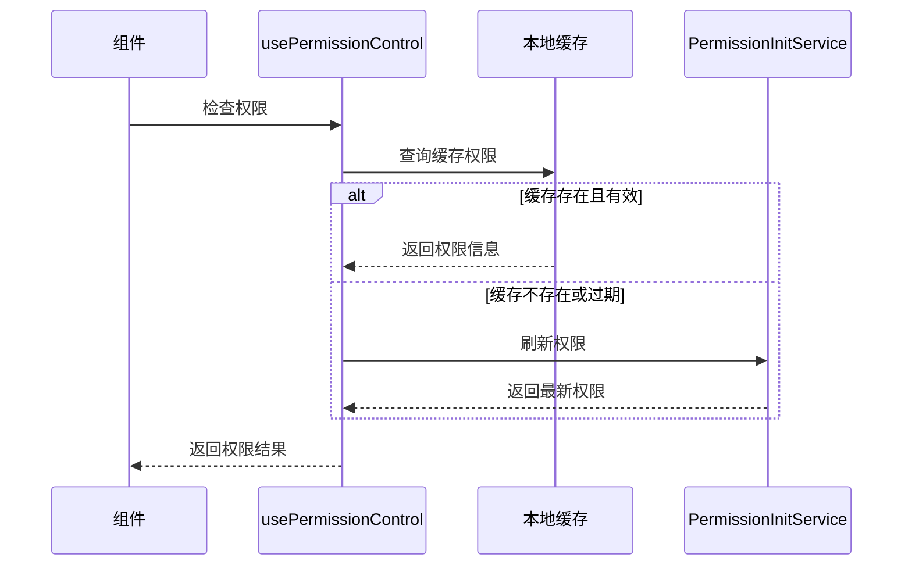

# 部门权限应用方案

## 概述

本文档详细说明了如何在现有系统中应用部门权限控制，实现用户登录后自动检测部门信息并匹配权限，以及在应用使用过程中如何应用权限控制。

## 系统架构

### 核心组件

1. **PermissionInitService** - 权限初始化服务
2. **usePermissionControl** - 权限控制主Hook
3. **PermissionControlComponents** - 权限控制UI组件
4. **AuthContext** - 认证上下文（已集成权限初始化）

### 权限级别定义

```javascript
const PERMISSION_LEVELS = {
  NONE: 0,    // 无权限
  READ: 1,    // 只读权限
  WRITE: 2,   // 读写权限
  ADMIN: 3    // 管理员权限
};
```

## 应用流程

### 1. 用户登录流程



### 2. 权限检查流程



## 实施步骤

### 步骤1: 权限数据结构设计

#### 用户部门关联表 (user_departments)
```sql
CREATE TABLE user_departments (
  id INT PRIMARY KEY AUTO_INCREMENT,
  ruoyi_user_id INT NOT NULL,
  department_id INT NOT NULL,
  role ENUM('member', 'leader', 'admin') DEFAULT 'member',
  is_primary BOOLEAN DEFAULT FALSE,
  created_at TIMESTAMP DEFAULT CURRENT_TIMESTAMP,
  updated_at TIMESTAMP DEFAULT CURRENT_TIMESTAMP ON UPDATE CURRENT_TIMESTAMP
);
```

#### 部门权限配置表 (department_permissions)
```sql
CREATE TABLE department_permissions (
  id INT PRIMARY KEY AUTO_INCREMENT,
  department_id INT NOT NULL,
  permission_key VARCHAR(100) NOT NULL,
  permission_level INT DEFAULT 1,
  created_at TIMESTAMP DEFAULT CURRENT_TIMESTAMP,
  updated_at TIMESTAMP DEFAULT CURRENT_TIMESTAMP ON UPDATE CURRENT_TIMESTAMP
);
```

### 步骤2: API接口实现

#### 获取用户部门信息
```javascript
// GET /api/user-departments/:ruoyiUserId
{
  "success": true,
  "data": [
    {
      "id": 1,
      "department_id": 101,
      "department_name": "IT部",
      "role": "admin",
      "is_primary": true
    }
  ]
}
```

#### 获取部门权限配置
```javascript
// GET /api/department-permissions/:departmentId
{
  "success": true,
  "data": [
    {
      "permission_key": "user.create",
      "permission_level": 2
    },
    {
      "permission_key": "user.edit",
      "permission_level": 2
    }
  ]
}
```

### 步骤3: 前端集成

#### 在App.js中包装权限提供者
```javascript
import { AuthProvider } from './context/AuthContext';

export default function App() {
  return (
    <AuthProvider>
      {/* 其他组件 */}
    </AuthProvider>
  );
}
```

#### 在页面中使用权限守卫
```javascript
import { PageGuard } from '../components/PermissionControlComponents';
import { PERMISSION_LEVELS } from '../hooks/usePermissionControl';

const UserManagementScreen = () => {
  return (
    <PageGuard 
      routePath="/user-management" 
      requiredLevel={PERMISSION_LEVELS.READ}
    >
      {/* 页面内容 */}
    </PageGuard>
  );
};
```

#### 在功能中使用功能守卫
```javascript
import { FeatureGuard } from '../components/PermissionControlComponents';

const CreateUserButton = () => {
  return (
    <FeatureGuard 
      permissionKey="user.create" 
      requiredLevel={PERMISSION_LEVELS.WRITE}
    >
      <TouchableOpacity onPress={handleCreateUser}>
        <Text>创建用户</Text>
      </TouchableOpacity>
    </FeatureGuard>
  );
};
```

### 步骤4: 权限配置

#### 定义权限键值
```javascript
// 用户管理权限
const USER_PERMISSIONS = {
  LIST: 'user.list',      // 查看用户列表
  CREATE: 'user.create',  // 创建用户
  EDIT: 'user.edit',      // 编辑用户
  DELETE: 'user.delete',  // 删除用户
  EXPORT: 'user.export'   // 导出用户
};

// 系统管理权限
const SYSTEM_PERMISSIONS = {
  CONFIG: 'system.config',     // 系统配置
  MONITOR: 'system.monitor',   // 系统监控
  BACKUP: 'system.backup',     // 数据备份
  LOG: 'system.log'            // 日志查看
};
```

#### 部门权限配置示例
```javascript
// IT部门权限配置
const IT_DEPARTMENT_PERMISSIONS = [
  { permission_key: 'user.list', permission_level: PERMISSION_LEVELS.READ },
  { permission_key: 'user.create', permission_level: PERMISSION_LEVELS.WRITE },
  { permission_key: 'user.edit', permission_level: PERMISSION_LEVELS.WRITE },
  { permission_key: 'system.config', permission_level: PERMISSION_LEVELS.ADMIN },
  { permission_key: 'system.monitor', permission_level: PERMISSION_LEVELS.READ }
];

// HR部门权限配置
const HR_DEPARTMENT_PERMISSIONS = [
  { permission_key: 'user.list', permission_level: PERMISSION_LEVELS.READ },
  { permission_key: 'user.create', permission_level: PERMISSION_LEVELS.WRITE },
  { permission_key: 'user.edit', permission_level: PERMISSION_LEVELS.WRITE },
  { permission_key: 'user.export', permission_level: PERMISSION_LEVELS.READ }
];
```

## 使用示例

### 页面级权限控制

```javascript
import React from 'react';
import { PageGuard } from '../components/PermissionControlComponents';
import { PERMISSION_LEVELS } from '../hooks/usePermissionControl';

const AdminPanel = () => {
  return (
    <PageGuard 
      routePath="/admin" 
      requiredLevel={PERMISSION_LEVELS.ADMIN}
      customMessage="此页面仅限管理员访问"
    >
      <View>
        <Text>管理员面板</Text>
        {/* 管理员功能 */}
      </View>
    </PageGuard>
  );
};
```

### 功能级权限控制

```javascript
import React from 'react';
import { FeatureGuard } from '../components/PermissionControlComponents';
import { PERMISSION_LEVELS } from '../hooks/usePermissionControl';

const UserActions = () => {
  return (
    <View>
      {/* 编辑按钮 - 需要写权限 */}
      <FeatureGuard 
        permissionKey="user.edit" 
        requiredLevel={PERMISSION_LEVELS.WRITE}
      >
        <Button title="编辑" onPress={handleEdit} />
      </FeatureGuard>
      
      {/* 删除按钮 - 需要管理员权限 */}
      <FeatureGuard 
        permissionKey="user.delete" 
        requiredLevel={PERMISSION_LEVELS.ADMIN}
      >
        <Button title="删除" onPress={handleDelete} />
      </FeatureGuard>
    </View>
  );
};
```

### 部门级权限控制

```javascript
import React from 'react';
import { DepartmentGuard } from '../components/PermissionControlComponents';

const DepartmentFeatures = () => {
  return (
    <View>
      {/* HR部门专用功能 */}
      <DepartmentGuard departmentKey="hr">
        <View>
          <Text>HR管理功能</Text>
          <Button title="员工档案" onPress={handleEmployeeFiles} />
        </View>
      </DepartmentGuard>
      
      {/* IT部门领导功能 */}
      <DepartmentGuard departmentKey="it" requireLeader={true}>
        <View>
          <Text>IT领导功能</Text>
          <Button title="团队管理" onPress={handleTeamManagement} />
        </View>
      </DepartmentGuard>
    </View>
  );
};
```

### 动态权限检查

```javascript
import React from 'react';
import { usePermissionControl } from '../hooks/usePermissionControl';

const DynamicComponent = () => {
  const { checkFeaturePermission, isGuest } = usePermissionControl();
  
  const handleAction = async () => {
    const hasPermission = await checkFeaturePermission('data.export', PERMISSION_LEVELS.READ);
    
    if (hasPermission) {
      // 执行导出操作
      exportData();
    } else {
      Alert.alert('权限不足', '您没有导出数据的权限');
    }
  };
  
  return (
    <View>
      {isGuest && (
        <Text style={styles.guestWarning}>
          您当前以访客身份访问，功能受限
        </Text>
      )}
      <Button title="导出数据" onPress={handleAction} />
    </View>
  );
};
```

## 访客权限处理

### 访客权限配置

```javascript
// 访客用户默认权限
const GUEST_PERMISSIONS = [
  { permission_key: 'dashboard.view', permission_level: PERMISSION_LEVELS.READ },
  { permission_key: 'profile.view', permission_level: PERMISSION_LEVELS.READ },
  { permission_key: 'help.view', permission_level: PERMISSION_LEVELS.READ }
];
```

### 访客状态检测

```javascript
import { usePermissionControl } from '../hooks/usePermissionControl';

const Component = () => {
  const { isGuest, userDepartments } = usePermissionControl();
  
  if (isGuest) {
    return (
      <View style={styles.guestContainer}>
        <Text>访客模式 - 功能受限</Text>
        <Button title="申请权限" onPress={requestPermissions} />
      </View>
    );
  }
  
  return (
    <View>
      {/* 正常功能 */}
    </View>
  );
};
```

## 缓存策略

### 权限缓存配置

```javascript
// 缓存配置
const CACHE_CONFIG = {
  USER_PERMISSIONS: {
    key: 'user_permissions',
    ttl: 30 * 60 * 1000  // 30分钟
  },
  USER_DEPARTMENTS: {
    key: 'user_departments',
    ttl: 60 * 60 * 1000  // 1小时
  },
  DEPARTMENT_PERMISSIONS: {
    key: 'department_permissions',
    ttl: 60 * 60 * 1000  // 1小时
  }
};
```

### 缓存刷新策略

1. **自动刷新**: 缓存过期时自动刷新
2. **手动刷新**: 用户主动刷新权限
3. **事件触发**: 权限变更时清除相关缓存

## 错误处理

### 权限检查失败处理

```javascript
const handlePermissionError = (error, context) => {
  console.warn(`权限检查失败 [${context}]:`, error);
  
  // 降级到访客权限
  return {
    hasPermission: false,
    level: PERMISSION_LEVELS.NONE,
    isGuest: true
  };
};
```

### 网络错误处理

```javascript
const handleNetworkError = async (error) => {
  console.warn('网络错误，使用缓存权限:', error);
  
  // 尝试使用缓存的权限数据
  const cachedPermissions = await loadCachedPermissions();
  
  if (cachedPermissions) {
    return cachedPermissions;
  }
  
  // 如果没有缓存，使用访客权限
  return getGuestPermissions();
};
```

## 性能优化

### 权限预加载

```javascript
// 在用户登录后预加载常用权限
const preloadPermissions = async (userId) => {
  const commonPermissions = [
    'dashboard.view',
    'profile.view',
    'user.list'
  ];
  
  await Promise.all(
    commonPermissions.map(permission => 
      checkFeaturePermission(permission, PERMISSION_LEVELS.READ)
    )
  );
};
```

### 权限批量检查

```javascript
// 批量检查多个权限
const checkMultiplePermissions = async (permissions) => {
  const results = await Promise.all(
    permissions.map(async ({ key, level }) => ({
      key,
      hasPermission: await checkFeaturePermission(key, level)
    }))
  );
  
  return results.reduce((acc, { key, hasPermission }) => {
    acc[key] = hasPermission;
    return acc;
  }, {});
};
```

## 监控和日志

### 权限访问日志

```javascript
const logPermissionAccess = (userId, permissionKey, result, context) => {
  console.log(`权限访问日志: {
    userId: ${userId},
    permission: ${permissionKey},
    result: ${result ? '允许' : '拒绝'},
    context: ${context},
    timestamp: ${new Date().toISOString()}
  }`);
};
```

### 权限异常监控

```javascript
const monitorPermissionExceptions = (error, context) => {
  // 发送错误报告到监控系统
  console.error(`权限异常 [${context}]:`, error);
  
  // 可以集成第三方监控服务
  // crashlytics.recordError(error);
};
```

## 测试策略

### 权限测试用例

```javascript
// 权限测试示例
describe('权限控制测试', () => {
  test('管理员应该有所有权限', async () => {
    const adminUser = { role_name: '超级管理员' };
    const hasPermission = await checkFeaturePermission('user.delete', PERMISSION_LEVELS.ADMIN);
    expect(hasPermission).toBe(true);
  });
  
  test('访客用户应该只有只读权限', async () => {
    const guestUser = { role_name: '访客' };
    const hasWritePermission = await checkFeaturePermission('user.create', PERMISSION_LEVELS.WRITE);
    expect(hasWritePermission).toBe(false);
  });
});
```

## 部署清单

### 数据库迁移
- [ ] 创建用户部门关联表
- [ ] 创建部门权限配置表
- [ ] 初始化基础权限数据

### 后端API
- [ ] 实现用户部门查询接口
- [ ] 实现部门权限查询接口
- [ ] 实现权限更新接口

### 前端集成
- [ ] 集成权限初始化服务
- [ ] 更新AuthContext
- [ ] 添加权限控制组件
- [ ] 更新现有页面使用权限守卫

### 测试验证
- [ ] 单元测试
- [ ] 集成测试
- [ ] 用户验收测试

## 总结

本权限应用方案提供了完整的部门权限控制解决方案，包括：

1. **自动权限检测**: 用户登录后自动检测部门信息并匹配权限
2. **多级权限控制**: 支持页面级、功能级、部门级权限控制
3. **访客权限处理**: 未识别权限的用户自动设为访客权限
4. **缓存优化**: 提供高效的权限缓存机制
5. **错误处理**: 完善的错误处理和降级策略
6. **易于使用**: 提供简单易用的Hook和组件

通过这套方案，可以实现细粒度的权限控制，确保系统安全性的同时提供良好的用户体验。